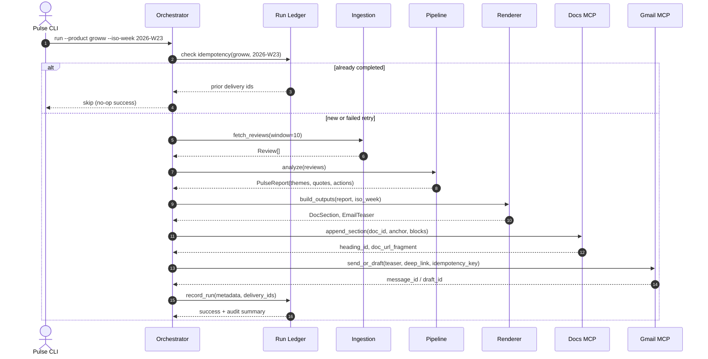
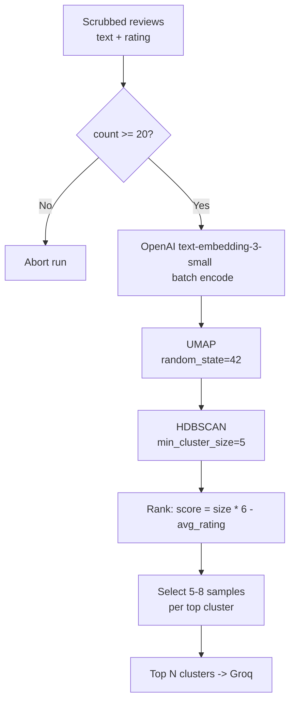

# Weekly Product Review Pulse — Architecture

This document describes the technical architecture for the Groww Play Store review pulse: components, data flows, MCP integration, idempotency, and operational concerns. It extends problemStatement.md.

## 1. Goals and Constraints

| Goal | Architectural implication |
| :--- | :--- |
| Weekly insight report from Play Store reviews | Batch pipeline, not streaming |
| Google Doc as system of record | Append-only sections with stable anchors |
| Email as notification, not duplicate report | Teaser + deep link to Doc heading |
| MCP-only delivery to Google Workspace | Pulse agent never holds Google OAuth or calls REST directly |
| Idempotent weekly runs | Run ledger + deterministic section keys |
| Auditable history | Persist run metadata and delivery IDs |
| Safe LLM usage | PII scrubbing, quote validation, token/cost caps |

Current scope: Groww · Google Play Store · Google Docs MCP + Gmail MCP (both in this repo).

## 2. System Context

```
                   ┌──────────────────────────────────────────┐
                   │               Stakeholders               │
                   └────────────────────┬─────────────────────┘
                                        │ (Reads Doc / Email)
                                        ▼
┌─────────────────────────────────────────────────────────────────────────────┐
│                            This Repository (m3_6)                            │
│                                                                             │
│  ┌───────────────────────┐                  ┌────────────────────────────┐  │
│  │   Pulse CLI / Scheduler │                  │    Google Workspace APIs   │  │
│  │                       ├─────────────────►│                            │  │
│  │     ┌───────────┐     │  Docs/Gmail MCP  │   ┌────────────────────┐   │  │
│  │     │Pulse Agent│     │  (stdio/IPC)     │   │  Google Doc        │   │  │
│  │     └─────┬─────┘     │                  │   └────────────────────┘   │  │
│  │           │           │                  │   ┌────────────────────┐   │  │
│  │     ┌─────▼─────┐     │                  │   │  Gmail             │   │  │
│  │     │In-Repo MCP│     │                  │   └────────────────────┘   │  │
│  │     │  Clients  │     │                  └────────────────────────────┘  │
│  └─────┬─────────┬───────┘                                                  │
└────────┼─────────┼──────────────────────────────────────────────────────────┘
         │         │
         │         │ (Embeddings / Summarization)
         ▼         ▼
┌──────────────────┐    ┌──────────────────┐
│Google Play Store │    │  Groq / OpenAI   │
│   (Ingestion)    │    │       APIs       │
└──────────────────┘    └──────────────────┘
```

The pulse agent orchestrates ingestion, analysis, rendering, and delivery. It connects to in-repo MCP servers as an MCP client. Google credentials and API access are confined to those servers.

## 3. Logical Layers

```
Layer 4 — Delivery (MCP)         [ Docs MCP Tools ] <───> [ Gmail MCP Tools ]
                                           ▲
                                           │
Layer 3 — Output Generation      [ Doc Section Builder ] <───> [ Email Teaser Builder ]
                                           ▲
                                           │
Layer 2 — Reasoning              [ Embedder ] ──► [ UMAP + HDBSCAN ] ──► [ Groq Summarizer ]
                                                                                 │
                                                                                 ▼
                                                                         [ Quote Validator ]
                                           ▲
                                           │
Layer 1 — Data Retrieval         [ Play Store Scraper ] ──► [ Review Normalizer ] ──► [ PII Scrubber ]
```

| Layer | Responsibility | Must not |
| :--- | :--- | :--- |
| Data retrieval | Fetch and normalize Play Store reviews for Groww | Call Google Workspace APIs |
| Reasoning | Cluster, summarize, validate quotes | Write to Docs or Gmail |
| Output generation | Build structured Doc blocks and email HTML/text | Hold Google OAuth |
| Delivery | Append Doc section, send/draft email | Contain clustering/LLM logic |

## 4. Repository Layout (Proposed)

```
m3_6/
├── docs/
│   ├── problemStatement.md
│   └── architecture.md
├── config/
│   ├── products/
│   │   └── groww.yaml          # Play Store app id, doc id, recipients
│   ├── pipeline.yaml           # window weeks, cluster params, LLM limits
│   └── mcp/
│       ├── docs-mcp.env.example
│       └── gmail-mcp.env.example
├── mcp-servers/
│   ├── google-docs-mcp/        # MCP server: Docs append, heading lookup
│   └── gmail-mcp/              # MCP server: draft, send, idempotency keys
├── pulse/
│   ├── cli.py                  # Entry: run, backfill, dry-run
│   ├── agent/
│   │   ├── orchestrator.py     # End-to-end run coordinator
│   │   └── mcp_client.py       # MCP host wiring
│   ├── ingestion/
│   │   ├── play_store.py       # Scraper + pagination
│   │   ├── normalizer.py       # Quality filters (words, language, emoji)
│   │   ├── cache.py            # reviews_raw / reviews_normalized cache
│   │   └── models.py           # Review, RawReview, RunContext
│   ├── pipeline/
│   │   ├── scrubber.py         # PII redaction
│   │   ├── embeddings.py
│   │   ├── clustering.py       # UMAP + HDBSCAN
│   │   ├── summarizer.py       # LLM theme/quote/action generation
│   │   └── quote_validator.py  # Substring match against source reviews
│   ├── render/
│   │   ├── doc_section.py      # Structured blocks for Docs MCP
│   │   └── email_teaser.py     # HTML + plain text teaser
│   └── ledger/
│       ├── store.py            # SQLite or JSON run ledger
│       └── models.py           # RunRecord, DeliveryRecord
├── data/                       # gitignored: cached reviews, run artifacts
└── tests/
```

This layout keeps MCP servers, the pulse pipeline, and configuration separable while shipping everything from one repo.

## 5. End-to-End Run Flow



### Run inputs

| Parameter | Description | Example |
| :--- | :--- | :--- |
| product | Product slug | groww |
| iso_week | ISO 8601 week | 2026-W23 |
| window_weeks | Rolling review window | 10 (within 8–12 configurable range) |
| dry_run | Skip MCP writes | false |
| email_mode | draft or send | draft in staging |

### Run outputs (audit record)

```json
{
  "run_id": "groww-2026-W23-abc123",
  "product": "groww",
  "iso_week": "2026-W23",
  "review_count": 872,
  "window_weeks": 10,
  "started_at": "2026-06-08T03:30:00+05:30",
  "completed_at": "2026-06-08T03:42:11+05:30",
  "doc_delivery": {
    "document_id": "...",
    "section_anchor": "groww-2026-W23",
    "heading_id": "...",
    "url": "https://docs.google.com/document/d/...#heading=..."
  },
  "email_delivery": {
    "mode": "draft",
    "message_id": "...",
    "idempotency_key": "groww-2026-W23-email"
  },
  "status": "completed"
}
```

## 6. Play Store Ingestion

### Responsibilities
* Resolve Groww’s Play Store listing from product config (`play_store_app_id` or package name).
* Scrape public reviews within the configured date window (8–12 weeks).
* Paginate until window boundary or no more pages.
* Normalize to a canonical `Review` model.

### Review models

**Raw cache** (`reviews_raw.json`) — full scrape payload per review:

| Field | Type | Notes |
| :--- | :--- | :--- |
| text | string | Raw review body |
| rating | int | 1–5 stars |
| published_at | datetime | UTC; used for window filtering |

**Normalized pipeline input** (`reviews_normalized.json`, `Review` in `models.py`) — what Phase 2 consumes:

| Field | Type | Notes |
| :--- | :--- | :--- |
| text | string | Review body passing quality filters |
| rating | int | 1–5 stars |

Phase 1 normalization (before cache write): ≥8 words, English-only (`allowed_language: en`), no emoji. Typical Groww pull: ~800–900 normalized reviews from ~5,000 raw (~17% kept). Future fields (`review_id`, `published_at`, `language`) may be added without changing the scrub → embed → cluster flow.

### Design decisions
* Cache raw and normalized pulls under `data/cache/{product}/{date}/` (`reviews_raw.json`, `reviews_normalized.json`, `manifest.json`) to avoid re-scraping on retries and to support audit (“what reviews were analyzed?”).
* Deduplicate raw reviews by hash of `(text, rating, published_at)` before normalization.
* Rate limiting with backoff; ingestion failures abort the run before any Doc/email write.
* No App Store adapter in v1; interface `ReviewSource` allows future sources without changing downstream pipeline.

## 7. Analysis Pipeline

Input: `list[Review]` with `{ text, rating }` from normalized cache or ingestion.

ML floor: If normalized review count <20, abort before embedding (orchestrator may also enforce `min_reviews` from product config).

### 7.1 PII scrubbing
Run before embedding, LLM calls, and publishing.

| Pattern class | Action |
| :--- | :--- |
| Email addresses | Redact → `[EMAIL]` |
| Phone numbers (IN formats) | Redact → `[PHONE]` |
| Long numeric sequences (PAN/Aadhaar-like) | Redact → `[ID]` |
| URLs with tokens | Redact path/query |
| Financial amounts (10k, lakhs, $…) | Keep in v1 — useful theme signal, not treated as PII |

Scrubbed text is used for embedding, LLM prompts, Doc output, and quote validation. Raw text stays in `reviews_raw.json` only (gitignored). The quote validator always compares against scrubbed cluster text.

### 7.2 Embeddings and clustering



| Parameter | Typical default | Config key |
| :--- | :--- | :--- |
| Embedding provider / model | OpenAI / `text-embedding-3-small` | `pipeline.embedding.*` |
| Embedding cache key | `sha256(scrubbed_text + rating)` | until `review_id` exists on Review |
| UMAP `n_neighbors` | 15 | `pipeline.clustering.umap.n_neighbors` |
| UMAP `n_components` | 5 | `pipeline.clustering.umap.n_components` |
| UMAP `random_state` | 42 | `pipeline.clustering.umap.random_state` |
| HDBSCAN `min_cluster_size` | 5 | `pipeline.clustering.hdbscan.min_cluster_size` |
| Top clusters to summarize | 3–5 | `pipeline.summarization.max_themes` |
| Samples per cluster | 5–8 (medoid + diversity) | `pipeline.summarization.max_samples_per_cluster` |

Cluster ranking: `score = cluster_size × (6 − avg_rating)` — prioritizes large low-star complaint themes (Groww cache is typically ~53% 1–2★).

Noise cluster (`label = −1`) reviews are excluded from theme generation unless volume exceeds a configurable threshold.

Clustering fallbacks (see `edge-cases.md` §3):
* **All noise**: Lower `min_cluster_size` once; if still all noise, abort or single rating-stratified LLM pass.
* **One cluster >80%**: Optional rating split (1–2★ vs 4–5★) before re-rank.
* **Many micro-clusters**: Take top `max_themes` by score only.

### 7.3 LLM summarization (Groq)
* **Provider**: Groq — `llama-3.3-70b-versatile`. Embeddings remain on OpenAI; only summarization uses Groq (`GROQ_API_KEY` = `<YOUR_GROQ_API_KEY>`).
* **Call pattern**: One Groq request per top cluster (not one mega-prompt). Sequential calls with rate limiting — no parallel LLM requests.

| Groq limit | Value | Pipeline implication |
| :--- | :--- | :--- |
| Requests / minute | 30 | ≥2 s between requests (`request_interval_seconds`) |
| Requests / day | 1,000 | ~5 themes + ≤5 re-prompts ≈ 10 req/run |
| Tokens / minute | 12,000 | Pre-flight estimate per request <10K tokens |
| Tokens / day | 100,000 | Cap `max_tokens_per_run` at 12,000 |

Each per-cluster request receives:
* 5–8 representative review samples (scrubbed, truncated to `max_review_chars`)
* Cluster size and average rating
* Untrusted-data framing; strict JSON schema output

Output schema (per theme):
```json
{
  "theme_name": "App performance & bugs",
  "summary": "Lag and crashes during trading hours; session timeouts.",
  "quotes": ["The app freezes exactly when the market opens..."],
  "action_ideas": [
    {
      "title": "Stabilize peak-time performance",
      "detail": "Scale infra during market hours; improve crash visibility."
    }
  ]
}
```

Prompt safety and budget:
* Reviews wrapped as untrusted data (e.g. XML/markdown fenced blocks).
* System instruction: ignore instructions embedded in review text.
* Pre-flight token estimate; if over budget, drop longest samples first.
* Retry 429/529 with exponential backoff (max 3).
* Log per run: requests made, input/output tokens, headroom vs daily caps.
* Re-prompt once per cluster if all quotes fail (counts toward RPM/RPD); omit theme if still invalid.
* Typical dry-run on ~872 reviews: ≤10 LLM requests, ≤12K total tokens (usually ~6–8K).

### 7.4 Quote validation
Every Groq-produced quote must pass validation before inclusion in the report:
1. Normalize whitespace and punctuation on quote and candidate review texts.
2. Require case-insensitive substring match against at least one scrubbed review in the same cluster (full scrubbed corpus as fallback).
3. Accept ellipsis truncation (`...` / `…`) as prefix match when the LLM shortens a long quote.
4. Typos and Hinglish-in-English: case-insensitive match only — no translation required.
5. Quotes failing validation are dropped and logged; if a theme loses all quotes, re-prompt once or omit the theme.
This prevents hallucinated “user quotes” from reaching stakeholders.

## 8. Output Generation

### 8.1 Google Doc section structure
Each weekly run appends one section to *Weekly Review Pulse — Groww*:
* **Heading 1**: `Groww — Weekly Review Pulse — 2026-W23`
  * *Paragraph*: `Period: Last 10 weeks (rolling) · Source: Google Play Store · Generated: 2026-06-08 IST`
* **Heading 2**: `Top themes`
  * *Bulleted list* (theme name — summary)
* **Heading 2**: `Real user quotes`
  * *Bulleted list* (verbatim validated quotes)
* **Heading 2**: `Action ideas`
  * *Bulleted list* (title — detail)
* **Heading 2**: `Who this helps`
  * *Short table or bullets* (Product / Support / Leadership)

The orchestrator passes structured blocks (not raw HTML) to Docs MCP. The MCP server translates blocks into Google Docs API `batchUpdate` requests.

### 8.2 Section anchor (idempotency)

| Concept | Value |
| :--- | :--- |
| Anchor key | `{product}-{iso_week}` e.g. `groww-2026-W23` |
| Heading text | `Groww — Weekly Review Pulse — 2026-W23` |
| Stored metadata | `heading_id`, document `revision_id` after write |

Idempotent Doc write behavior:
1. Docs MCP searches the document for an existing heading matching the anchor key (custom heading property or deterministic heading text).
2. If found → return existing `heading_id` and URL fragment; do not append again.
3. If not found → append section at end (or configured insertion point).

### 8.3 Email teaser
Email body is intentionally short:
* **Subject**: `Groww Weekly Review Pulse — 2026-W23`
* **Body**: 3–5 bullet theme headlines + one-line context
* **CTA**: *Read full report* → deep link to Doc section (`#heading={heading_id}` or equivalent)
* **Footer**: generation timestamp, review window, link to full Doc

Full report content lives only in the Doc.

## 9. MCP Server Architecture
Both servers are stdio MCP servers (or SSE for local dev) shipped in `mcp-servers/`. They encapsulate Google OAuth, token refresh, and REST calls.

```
                          ┌─────────────────────┐
                          │     Pulse Agent     │
                          │    (MCP Client)     │
                          └──────────┬──────────┘
                                     │
                   ┌─────────────────┴─────────────────┐
                   │ (stdio)                           │ (stdio)
                   ▼                                   ▼
       ┌───────────────────────┐           ┌───────────────────────┐
       │    google-docs-mcp    │           │       gmail-mcp       │
       │     (MCP Server)      │           │     (MCP Server)      │
       └───────────┬───────────┘           └───────────┬___________┘
                   │                                   │
                   ├─ append_section                   ├─ check_idempotency
                   ├─ find_section_by_anchor           ├─ create_draft
                   └─ get_document_url                 └─ send_email
                   │                                   │
                   ▼                                   ▼
          [ Google Docs API ]                     [ Gmail API ]
```

### 9.1 Google Docs MCP — tools

| Tool | Purpose | Key inputs | Key outputs |
| :--- | :--- | :--- | :--- |
| `find_section_by_anchor` | Idempotency lookup | `document_id`, `anchor` | `found`, `heading_id`, `url_fragment` |
| `append_section` | Add weekly section | `document_id`, `anchor`, `blocks[]`, `insert_at_end` | `heading_id`, `revision_id`, `url` |
| `get_document_url` | Resolve shareable link | `document_id`, `heading_id?` | `url` |

Credential handling: OAuth client id/secret, refresh token, and scopes live in `config/mcp/docs-mcp.env` (never committed). Server loads env at startup.
Required scopes (indicative): `https://www.googleapis.com/auth/documents`

### 9.2 Gmail MCP — tools

| Tool | Purpose | Key inputs | Key outputs |
| :--- | :--- | :--- | :--- |
| `check_idempotency` | Prevent duplicate sends | `idempotency_key` | `already_sent`, `message_id?` |
| `create_draft` | Staging default | `to[]`, `subject`, `html_body`, `text_body`, `idempotency_key` | `draft_id` |
| `send_email` | Production send | same as draft | `message_id` |

Idempotency key format: `{product}-{iso_week}-email` (e.g. `groww-2026-W23-email`).
Implementation options:
* Ledger inside Gmail MCP: SQLite table keyed by `idempotency_key`.
* Gmail label + search: Less preferred; ledger is clearer.

Required scopes (indicative): `https://www.googleapis.com/auth/gmail.compose` or `https://www.googleapis.com/auth/gmail.send` depending on send vs draft-only policy.

### 9.3 Pulse agent MCP client
The agent:
1. Spawns MCP servers as subprocesses (or connects via configured transport).
2. Discovers tools via MCP protocol.
3. Calls tools in order: `find_section_by_anchor` → `append_section` (if needed) → `check_idempotency` → `create_draft` / `send_email`.
4. Never imports Google API client libraries for delivery.

Example agent config (`config/mcp/servers.json`):
```json
{
  "mcpServers": {
    "google-docs": {
      "command": "python",
      "args": ["mcp-servers/google-docs-mcp/server.py"],
      "envFile": "config/mcp/docs-mcp.env"
    },
    "gmail": {
      "command": "python",
      "args": ["mcp-servers/gmail-mcp/server.py"],
      "envFile": "config/mcp/gmail-mcp.env"
    }
  }
}
```

## 10. Run Ledger and Audit
Central run ledger (SQLite recommended) owned by the pulse agent, written after successful MCP delivery.

Table: `runs`

| Column | Description |
| :--- | :--- |
| `run_id` | UUID |
| `product` | groww |
| `iso_week` | `2026-W23` |
| `status` | pending, completed, failed |
| `review_count` | int |
| `window_weeks` | int |
| `started_at`, `completed_at` | timestamps |
| `error_message` | nullable |

Table: `deliveries`

| Column | Description |
| :--- | :--- |
| `run_id` | FK → `runs` |
| `channel` | google_doc, gmail |
| `external_id` | heading_id, message_id, draft_id |
| `url` | Doc or Gmail link |
| `idempotency_key` | nullable |

Unique constraint: `(product, iso_week)` on `runs` where `status = completed` — enforces at-most-one successful run per week at the orchestrator level, complementing MCP-level checks.

## 11. Configuration

Product config — `config/products/groww.yaml`
```yaml
product: groww
display_name: Groww
play_store:
  app_id: com.nextbillion.groww  # example; verify at build time
ingestion:
  window_weeks: 10
  min_reviews: 20
  max_reviews: 5000
  min_words: 8
  allowed_language: en
delivery:
  google_doc_id: "<SHARED_DOC_ID>"
  email:
    recipients:
      - product-leads@example.com
      - support-leads@example.com
    default_mode: draft  # draft | send
```

Pipeline config — `config/pipeline.yaml`
```yaml
embedding:
  provider: openai
  model: text-embedding-3-small
  batch_size: 64
clustering:
  umap:
    n_neighbors: 15
    n_components: 5
    metric: cosine
  hdbscan:
    min_cluster_size: 5
    min_samples: 3
summarization:
  provider: groq
  model: llama-3.3-70b-versatile
  max_themes: 5
  max_tokens_per_run: 12000
  max_samples_per_cluster: 8
  max_output_tokens_per_theme: 800
  request_interval_seconds: 2
safety:
  scrub_pii: true
  max_review_chars: 2000
```

Environment-specific overrides via env vars (e.g. `PULSE_EMAIL_MODE=send`, `GROQ_API_KEY` for summarization, OpenAI key for embeddings).

## 12. CLI and Scheduling

CLI commands

| Command | Description |
| :--- | :--- |
| `pulse run --product groww [--iso-week YYYY-Www]` | Run for current or specified ISO week |
| `pulse backfill --product groww --from 2026-W01 --to 2026-W20` | Sequential backfill with idempotency |
| `pulse dry-run --product groww` | Full pipeline except MCP writes |
| `pulse status --product groww --iso-week 2026-W23` | Show ledger + delivery ids |

Default ISO week: week containing the run date, or previous complete week if running Monday morning IST before reviews stabilize (configurable policy).

Scheduler:
Cron / GitHub Actions / Cloud Scheduler invokes `pulse run --product groww` weekly (e.g. Monday 09:00 IST).
Scheduler passes secrets (`GROQ_API_KEY`, embedding provider key) via env; Google secrets stay with MCP servers only.

## 13. Security and Safety

| Risk | Mitigation |
| :--- | :--- |
| Google OAuth leakage | Credentials only in MCP server env files; gitignored |
| PII in reports | Scrubber before LLM and publish |
| Prompt injection via reviews | Data/non-instruction framing; no tool execution from review text |
| Hallucinated quotes | Substring validator against source reviews |
| Runaway LLM cost / Groq rate limits | `max_tokens_per_run`, per-cluster sample caps, sequential requests, 429 backoff |
| Duplicate stakeholder email | Idempotency key + ledger + Docs anchor |
| Scraping abuse / blocks | Rate limits, retries, user-agent policy |

## 14. Error Handling and Partial Failure

| Failure point | Behavior |
| :--- | :--- |
| Ingestion fails | Abort; no Doc/email; ledger failed |
| Pipeline/LLM fails | Abort; no Doc/email; ledger failed |
| Doc append succeeds, Gmail fails | Ledger failed with partial delivery; retry safe via idempotency (Doc no-op, Gmail retried) |
| Gmail succeeds, ledger write fails | Log critical alert; MCP idempotency still prevents duplicate email on retry |

Retries: orchestrator may retry transient MCP errors with exponential backoff (max 3). Non-transient errors (auth, invalid doc id) fail fast.

## 15. Observability

| Signal | Mechanism |
| :--- | :--- |
| Structured logs | JSON logs per stage with `run_id`, `product`, `iso_week` |
| Metrics | Review count, cluster count, Groq requests/tokens, embedding batch count, duration per stage |
| Artifacts | Optional JSON report snapshot in `data/runs/{run_id}/` |
| Audit queries | CLI status + SQL against ledger |

## 16. Environments

| Environment | Email mode | Doc target | Notes |
| :--- | :--- | :--- | :--- |
| Local dev | draft | Test Doc id | dry-run available |
| Staging | draft | Staging Doc | Requires explicit `--send` to override |
| Production | send | Production Doc | Scheduler default |

## 17. Testing Strategy

| Layer | Approach |
| :--- | :--- |
| Ingestion | Fixture HTML/JSON snapshots; no live scrape in unit tests |
| Scrubber / validator | Table-driven tests on synthetic PII and quotes |
| Clustering | Golden-file tests on fixed embedding inputs |
| Summarizer | Mock Groq client; schema validation; rate-limit retry tests |
| Docs/Gmail MCP | Contract tests with mocked Google API |
| Orchestrator | Integration test: full run with MCP mocks + ledger idempotency |
| E2E (manual) | One dry-run and one draft email against real Google APIs in staging |

## 18. Future Expansion (Out of Scope for v1)
Architectural extension points already implied by the design:

| Extension | Touch points |
| :--- | :--- |
| Additional products | New `config/products/*.yaml`; reuse pipeline + MCP |
| App Store RSS | New `ingestion/app_store.py` implementing `ReviewSource` |
| Multi-source merge | Fan-in before embed step; source dimension on `Review` |
| BI dashboard | Read from ledger + exported JSON; Doc remains canonical |
| Richer MCP | Additional tools only if pulse needs them; avoid generic Workspace scope |

## 19. Architecture Decision Summary

| Decision | Choice | Rationale |
| :--- | :--- | :--- |
| Delivery to Google | In-repo MCP servers | Matches problem constraint; isolates OAuth |
| Doc as source of truth | Append sections with anchors | History + idempotency + stakeholder link target |
| Email content | Teaser + deep link | Avoid duplicate maintenance |
| Clustering | DBSCAN / K-Means fallback | Unsupervised theme discovery without fixed taxonomy, with fallback for Windows local testing |
| Cluster ranking | `size * (6 - avg_rating)` | Surfaces actionable low-star complaint themes |
| Summarization LLM | Groq `llama-3.3-70b-versatile` | Cost-effective; per-cluster calls respect 12K TPM |
| Embeddings | OpenAI `text-embedding-3-small` | Separate from Groq; batch-friendly for ~800+ reviews |
| Quote trust | Post-LLM substring validation against scrubbed text | Prevents fabricated user voice |
| Idempotency | Anchor + email key + ledger | Safe weekly cron and backfill |
| v1 scope | Groww Play Store only | Reduce ingestion and config surface |

## 20. Related Documents
* `problemStatement.md` — product intent, requirements, and non-goals
* `implementation_plan.md` — phase-wise build plan and exit criteria
* `edge-cases.md` — clustering fallbacks, quote validation, and failure modes
