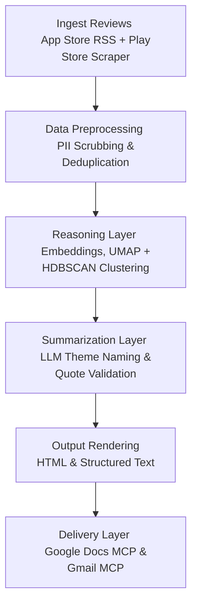

# 📊 Weekly Product Review Pulse — Problem Statement

This document details the objective, workflow, architecture, and requirements for building the **Weekly Product Review Pulse** automation system.

---

## 🎯 Objective
Provide product, support, and leadership teams with a repeatable, automated weekly snapshot of customer sentiment from store reviews (themes, quotes, and action items) without manual copy-pasting or maintaining custom spreadsheets.

---

## 🚀 Scope & System Workflow

The system is designed as an automated weekly job (e.g., scheduled for Monday morning IST) with CLI capability for manual backfills of any historical ISO week.

### 1. Data Ingestion
*   **Sources**: App Store (iTunes customer reviews RSS) and Google Play Store (scraper-based).
*   **Configuration**: 8–12 weeks configurable rolling window.
*   **Initial Supported Products**:
    *   INDMoney
    *   Groww
    *   PowerUp Money
    *   Wealth Monitor
    *   Kuvera

### 2. Processing & Reasoning Layer
*   **Clustering**: Uses embeddings combined with density-based clustering (e.g., UMAP + HDBSCAN) to group reviews into logical feedback themes.
*   **Summarization**: Leverages a Large Language Model (LLM) to name clustered themes, extract representative quotes, and suggest actionable roadmap recommendations.
*   **Validation**: Validates that any extracted user quotes exactly match real, verbatim text from the ingested store reviews.
*   **PII Scrubbing**: Automatically scrubs Personally Identifiable Information (PII) before passing text to the LLM and before final delivery.

### 3. Modular System Architecture
The internal codebase will be decoupled according to the following concerns:

| Concern | Responsibility | Location |
| :--- | :--- | :--- |
| **Data Retrieval** | Ingesting modules from App Store & Play Store | `ingestion/` |
| **Reasoning** | Clustering (UMAP + HDBSCAN) + LLM Summarization | `analysis/` |
| **Output Generation** | Rendering report layouts & email templates | `rendering/` |
| **Delivery** | Interfacing with Google Docs & Gmail | `mcp_delivery/` |

> [!IMPORTANT]
> **MCP-Based Delivery (No Embedded Credentials):**
> The system operates strictly as an MCP client. It does not embed Google API credentials or make raw HTTP REST calls to Google APIs. Instead, it interacts with standard Google Docs and Gmail MCP servers via dedicated MCP tools.

---

## 🛠️ Key Requirements

*   **Idempotency**: Re-running the pipeline for the same product and ISO week must not create duplicate sections in the Google Doc or resend notification emails.
    *   *Docs*: Enforced with a stable heading/section anchor.
    *   *Email*: Enforced with a run-scoped idempotency check.
*   **Auditability**: Every run must log metadata and delivery identifiers (e.g., Google Doc heading links or Gmail message IDs) to keep a clear audit trail.
*   **Safety & Quality**: Inbound reviews are treated strictly as data (not instructions) to prevent prompt injection. Cost and token caps are enforced per run.

---

## 🚫 Non-Goals
*   Building a generic Google Workspace management tool beyond Docs appending and Gmail drafting/sending.
*   Implementing real-time streaming analytics or a dedicated BI dashboard (the running Google Doc acts as the system of record).
*   Supporting social media platforms (Twitter, Reddit, etc.) in the initial scope.
*   Storing Google OAuth secrets in the core application codebase.

---

## 👥 Who This Helps

| Audience | Value |
| :--- | :--- |
| **Product Teams** | Prioritize roadmap tasks based on repeating complaints and themes. |
| **Support Teams** | Identify recurring bugs and customer service friction. |
| **Leadership** | Quick, high-level health snapshot tied directly to the voice of the customer. |

---

## 📝 Illustrative Output Sample

### **Groww — Weekly Review Pulse**
* **Period**: Last 8–12 weeks (rolling window)

#### **Top Themes**
1.  **App Performance & Bugs**: Lag and crashes during market hours; login timeouts.
2.  **Customer Support Friction**: Unresolved tickets and slow response times.
3.  **UX & Feature Gaps**: Confusing navigation for portfolio analysis; missing charts.

#### **Real User Quotes**
*   *“The app freezes exactly when the market opens, very frustrating.”*
*   *“Support takes days to reply and doesn’t solve the issue.”*
*   *“Good for beginners but lacks detailed analysis tools.”*

#### **Action Ideas**
*   **Stabilize Peak-Time Performance**: Scale backend infrastructure during early market hours.
*   **Improve Support SLA Visibility**: Display expected response times inside the support module.
*   **Enhance Power-User Features**: Build detailed portfolio analytics and cleaner navigation paths.
